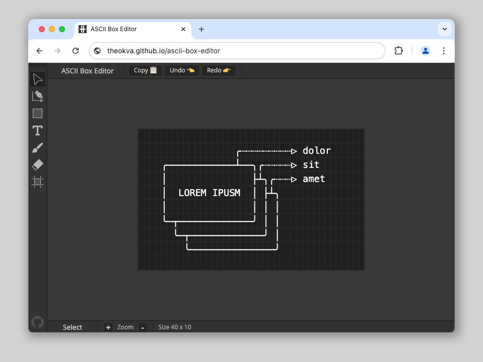
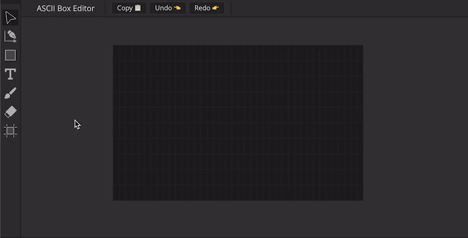
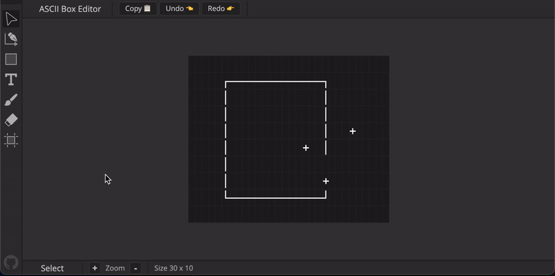
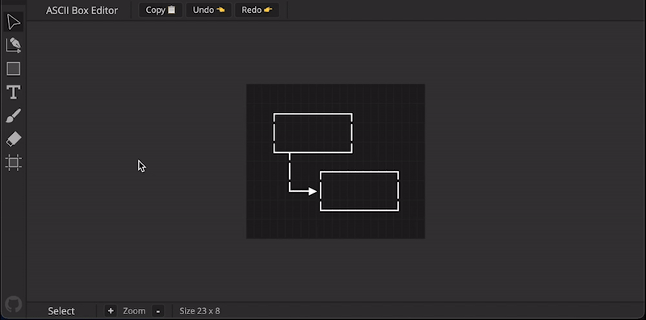
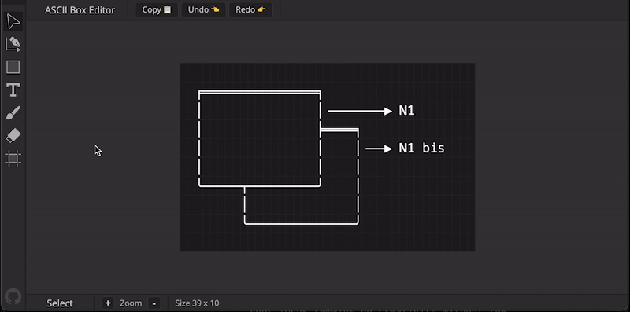
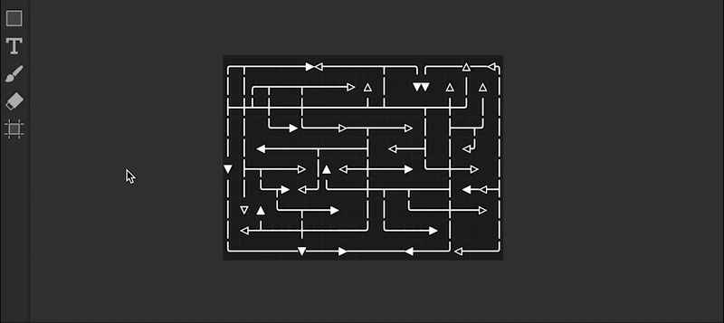
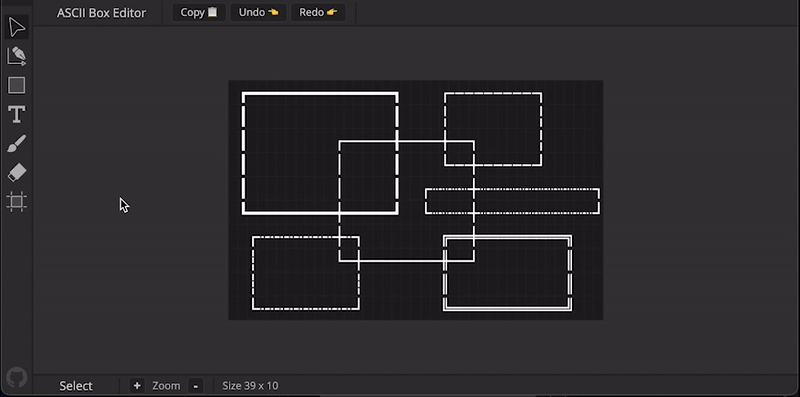
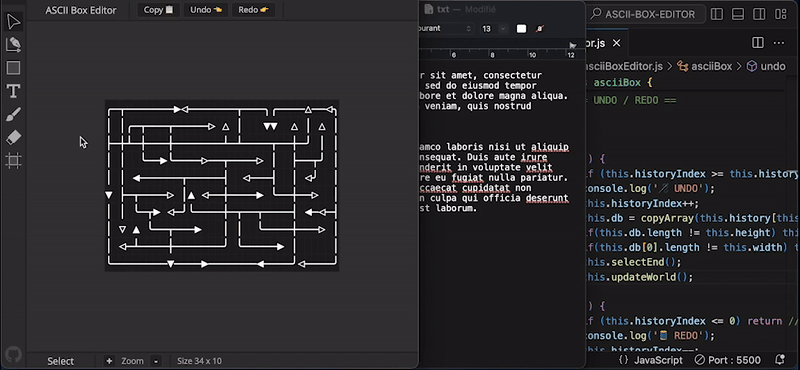

# ASCII BOX EDITOR
[](https://www.gnu.org/licenses/gpl-3.0)

[](https://TheoKVA.github.io/ascii-box-editor/)
[](https://github.com/TheoKVA/)



> Try it: [**theokva.github.io/ascii-box-editor**](https://theokva.github.io/ascii-box-editor) 👋

ASCII BOX EDITOR is an intuitive and minimalist web application designed to simplify the creation of ASCII art with just a few clicks. This tool leverages the simplicity of ASCII characters, such as box corners and line intersections, to help users effortlessly draw complex intersected ASCII boxes, create lines with customized styles and end-caps, and embed text within their designs.

Whether you're looking to design a complex code comment, make a specific table layouts, draw structured ASCII diagrams, or simply explore the artistic potential of ASCII, this tool provides a straightforward, accessible platform to translate your ideas into detailed ASCII graphics.

## Table of Contents  
1. [ Key Features. ](#features)
2. [ Usage & Technology. ](#usage)
3. [ Exemples. ](#exemples)
3. [ Authors and acknowledgment. ](#authors)
4. [ Licence. ](#licence)
5. [ Project status. ](#status)

<a name="features"></a>

## Key Features


**Drawing Tools**
<br>Easily draw boxes or lines with options for different styles including bold, simple, double, and dotted lines.


---

**Customizable Line Style**
<br>Enhance your lines with customizable end-caps, such as arrows, to suit various diagramming needs.


---

**Text Tool**
<br>Add and position text anywhere on your canvas, perfect for labels or annotations.


---

**Special Character Brush**
<br>‘Paint’ with special characters by choosing from a predefined set, enabling artistic freedom and detail.


---

**Flexible Canvas**
<br>Start with a blank, resizable canvas tailored to the size of your project.


---

**Minimalist Design**
<br>A clean, user-friendly interface ensures that your focus remains on creativity without the clutter of complex menus.


---

**Simple integration**
<br>No need for tedious exports, just copy-past your creation to integrate it anywhere you see fit.


---

**Offline Capability**
<br>Work Anywhere, anytime: once loaded, ASCII BOX EDITOR doesn't require an internet connection, ensuring complete privacy and uninterrupted productivity.

---


<a name="usage"></a>

## Usage & Technology
The tool is designed to be self-explanatory, featuring an easy-to-navigate interface that requires no prior setup. Users can simply access the web app, and start creating ASCII art immediately.
<br>Developed using Vanilla JavaScript in an object-oriented programming style, the app emphasizes performance and ease of use, ensuring it's accessible to users regardless of their technical background.

To get started with ASCII BOX EDITOR, go to the [url](https://theokva.github.io/ascii-box-editor). No installation required—create and export your ASCII designs directly from your browser! 👌

> [**theokva.github.io/ascii-box-editor**](https://theokva.github.io/ascii-box-editor)


<a name="exemples"></a>

## Exemples

```   
                  ╭┈┈┈┈┈┈┈┈▷ Lorem     
    ╒═════════════╧═╕╭┈┈┈┈┈▷ ipsum     
    │               ╞╧╕╭┈┈┈▷ dolor     
    │  LOREM IPUSM  │ ╞╧╕              
    │               │ │ │              
    ╰─┬─────────────╯ │ │              
      ╰─┬─────────────╯ │              
        ╰───────────────╯              
```

```
╭─┬───────▶◁───────┬──╮ ╭────△──◁╮
│ │╭─┬───┬─────▷ △ │  ▽ ▼  △ │ △ │
├─┼┴─┼───┼───────┴─┴────┬──┼─╯ │ │
│ │  ╰──▶╰────▷──┬────▷ │  ├──┬╯ │
│ │ ◀──────┬─────┤  ◁───┤  │ ◁╯  │
▼ ├─┬────▷ │▲ ◁──┼────▶ ╰──┼──▷  │
│ │ ╰─┬▶ ◁─╯╰────┼─┬──┬────┤ ◀─◁─┤
│ ▽ ▲ ╰──┬───▶   │ │  ╰────┼───▷ │
│ ◁─┴────┼───────╯ ╰─────▶ │     │
╰────────▼────▶───────◀────╯◁────╯       
```

```
  ╭────────────┬───╮
  │ Select     │ ▼ │
  ╰────────────┴───╯
```

```
┌─┬┐  ╔═╦╗  ╓─╥╖  ╒═╤╕
│ ││  ║ ║║  ║ ║║  │ ││
├─┼┤  ╠═╬╣  ╟─╫╢  ╞═╪╡
└─┴┘  ╚═╩╝  ╙─╨╜  ╘═╧╛
┌───────────────────┐
│  ╔═══╗ Some Text  │▒
│  ╚═╦═╝ in the box │▒
╞═╤══╩══╤═══════════╡▒
│ ├──┬──┤           │▒
│ └──┴──┘           │▒
└───────────────────┘▒
 ▒▒▒▒▒▒▒▒▒▒▒▒▒▒▒▒▒▒▒▒▒
```


<a name="authors"></a>

## Authors and acknowledgment

- Coded with Vanilla JS, HTML, and CSS
- Built with ❤️ by Theo Francart

<a name="licence"></a>

## License

This project is licensed under the GNU General Public License v3.0.
<br>You are free to use, study, share, and modify the software — as long as you keep it open and share alike.

<a name="status"></a>

## Project status

ASCII BOX EDITOR is currently in a maintenance phase. If you encounter any issues or bugs, please feel free to open a bug report on GitHub. 
<br>Your contributions and feedback are highly appreciated to help improve the tool further.

🙏
